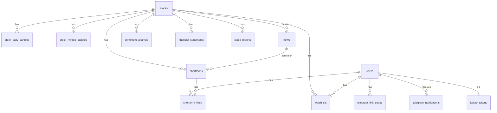

# SCHEMA.md — DB 스키마 설계

> 기준 문서: [`PRODUCT.md`](./PRODUCT.md), [`PRD.md`](./PRD.md), 원본 크롤링 데이터 [`docs/data/raw/`](./docs/data/raw)
> DDL 위치: [`docs/data/sql/schema.sql`](./docs/data/sql/schema.sql) (테이블), [`docs/data/sql/seed.sql`](./docs/data/sql/seed.sql) (5종목 시드)
> DB: PostgreSQL (PRD §7.2 확정)

---

## 0. 공통 규칙

- 모든 테이블에 `created_at`, `updated_at` (`TIMESTAMPTZ`) 포함. `updated_at`은 공통 트리거 함수 `set_updated_at()`으로 UPDATE 시 자동 갱신 (직접 SET 안 해도 됨).
- 긍정/부정/중립, 뉴스/토스_커뮤니티, 매수/중립/매도 같은 분류값은 별도 코드 테이블 없이 **한글 텍스트 그 자체**를 `VARCHAR` + `CHECK` 제약으로 저장한다 (요청사항 그대로, 조회/디버깅 시 조인 없이 바로 읽힘).
- 종목은 `stocks` 테이블로 정규화하고 나머지 테이블은 `stock_id` FK로 참조한다 (원문 크롤링 데이터의 "종목명" 텍스트는 적재 시 `stocks.name`으로 매칭). PRD §8 확장성 요구("종목 추가는 DB 레코드 추가만으로") 충족.

---

## 1. 뉴스/커뮤니티 — `news`

원본 크롤링 파일(`docs/data/raw/*.csv`) 두 종류를 하나의 테이블로 통합한다.

| 컬럼 | 타입 | 설명 |
| --- | --- | --- |
| id | BIGSERIAL PK | |
| date | DATE | 날짜 |
| stock_id | INTEGER FK → stocks.id | 종목명 |
| source_type | VARCHAR(20) CHECK ('뉴스', '토스_커뮤니티') | 종류 |
| headline | TEXT | 뉴스 헤드라인 (토스는 게시글 제목/본문) |
| url | TEXT, NULL 허용 | 뉴스_URL |
| created_at / updated_at | TIMESTAMPTZ | |

`CHECK (source_type <> '토스_커뮤니티' OR url IS NULL)` — 토스 커뮤니티 행은 url이 항상 NULL이 되도록 DB 레벨에서 강제.

### raw 데이터 → `news` 매핑

**`삼성전자_연합뉴스_최근15일.csv`** (컬럼: 기업명, 언론사, 제목, 날짜, URL)

| news 컬럼 | 원본 컬럼 |
| --- | --- |
| date | 날짜 |
| stock_id | 기업명 → `stocks.name` 매칭 |
| source_type | 고정값 `'뉴스'` |
| headline | 제목 |
| url | URL |

(언론사 컬럼은 이번 스키마에 넣지 않음 — 요청 컬럼 범위 밖. 필요해지면 `press` 컬럼 추가로 확장.)

**`toss_community_samsung_30d.csv`** (컬럼: post_id, created_at, user_name, is_shareholder, follower_count, title, content, trade_review, like_count, reply_count, repost_count, read_count, image_urls)

| news 컬럼 | 원본 컬럼 |
| --- | --- |
| date | created_at 의 날짜 부분 |
| stock_id | 파일명 기준 종목(`삼성전자`) → `stocks.name` 매칭 |
| source_type | 고정값 `'토스_커뮤니티'` |
| headline | title이 있으면 title, 없으면 content (샘플 데이터는 title이 대부분 빈 값) |
| url | 항상 NULL (토스 게시글 URL 없음) |

toss 원본의 `like_count`/`read_count` 등 참여도 지표는 이번 스키마 범위 밖(요청 컬럼에 없음). 추후 필요 시 `news`에 컬럼 추가 또는 별도 테이블 분리.

---

## 2. 감성분석 — `sentiment_analysis`

| 컬럼 | 타입 | 설명 |
| --- | --- | --- |
| id | BIGSERIAL PK | |
| date | DATE | 날짜 |
| stock_id | INTEGER FK → stocks.id | 종목명 |
| sentiment | VARCHAR(10) CHECK ('긍정','부정','중립') | 감성 (text 그 자체) |
| created_at / updated_at | TIMESTAMPTZ | |

`UNIQUE (date, stock_id)` — **(날짜, 종목) 단위 1건**으로 설계했다. `news`와는 `stock_id` + `date`로 조인한다:

```sql
SELECT n.headline, n.source_type, n.url, s.sentiment
FROM news n
JOIN sentiment_analysis s
  ON n.stock_id = s.stock_id AND n.date = s.date
WHERE n.stock_id = :stock_id
ORDER BY n.date DESC;
```

`UNIQUE (date, stock_id)`가 있기 때문에 이 조인은 `news` 여러 건이 그날의 감성 라벨 1건에 매칭되는 N:1 조인이라 팬아웃(row 중복 생성)이 없다.

> ⚠️ **가정**: PRD §7.4는 "뉴스 분류(기사 단위 배치)"와 "커뮤니티 감성 스코어(게시글 묶음 단위)"를 별개 로직으로 설명한다. 요청하신 컬럼(날짜/종목명/감성)만으로는 기사 1건 단위 라벨을 표현할 수 없어, 이번 스키마는 **하루·종목 단위로 집계된 감성 라벨 1개**로 해석했다 (F-05 날씨 위젯과 동일한 그레인). 기사 단위로 감성을 붙이고 싶다면 `sentiment_analysis`에 `news_id` FK를 추가하고 `UNIQUE(news_id)`로 바꾸는 구조가 필요하다 — 지금 스펙대로면 이 변경 전까지는 기사별이 아니라 종목·날짜별 감성만 저장된다.

---

## 3. 나머지 테이블 (PRODUCT.md 기준)

PRODUCT.md의 기능(F-01~F-05)·이슈 단위를 그대로 테이블로 옮겼다. P2(F-05 커뮤니티 민심)는 별도 테이블 없이 위 `news`/`sentiment_analysis`에 이미 흡수되어 있다.

| 테이블 | 대응 기능 | 요약 |
| --- | --- | --- |
| `stocks` | 공통 | 5종목 마스터 (코드/종목명/시장) |
| `stock_daily_candles` | F-01 | 일봉. `UNIQUE(stock_id, trade_date)` |
| `stock_minute_candles` | F-01 | 분봉(장중 5분 저장). `UNIQUE(stock_id, traded_at)` |
| `market_indices` | F-01 대시보드 | 코스피/코스닥/환율 스냅샷. 외부 API 장애 시 `recorded_at` 기준 마지막 캐시값 노출(PRD §8) |
| `financial_statements` | F-03-2 | DART 연도별 매출/영업이익/영업이익률 |
| `stock_reports` | F-03 전체 | 1일 1회 배치로 생성되는 리포트 캐시(ISSUE-C4). 투자판단·근거·재무추세·리스크스코어·동종비교·52주밴드를 종목×날짜 1행에 저장. 리스크스코어(F-03-3)와 동종비교(F-03-5)는 항목 수가 가변적이라 `JSONB`로 저장 |
| `shortforms` | F-02 | 종목당 긍정/부정 각 1건, `news_id`로 원문 추적(§9.3 환각 방지), 좋아요/조회수 카운터 |
| `shortform_likes` | F-02 | 사용자별 좋아요 토글 상태(ISSUE-E2) |
| `users` | 공통 | 사용자. 신원 확인은 `kakao_tokens`(카카오 OAuth, ISSUE-001)가 담당하고 `device_id`는 로그인 전 흔적용 옵션 컬럼(NULL 허용)으로 격하 |
| `watchlists` | F-04 | 관심종목 |
| `telegram_link_codes` | F-04 | 일회용 연동 코드 → chat_id 매핑 전 단계 |
| `telegram_notifications` | F-04 | 발송 로그. 브리핑(종목 무관)/시그널(종목별) 중복 발송 방지용 부분 유니크 인덱스 2개 |
| `kakao_tokens` | 인증(카카오 OAuth) | `users`와 1:1(`user_id UNIQUE`). access/refresh 토큰 및 각각의 만료 시각 저장 |

### 3.1 리포트 6블록 ↔ 테이블 매핑

| 블록 | 테이블 |
| --- | --- |
| F-03-1 투자판단 요약 | `stock_reports.judgement`, `judgement_reasons` |
| F-03-2 매출/영업이익 분석 | `financial_statements` (원본) + `stock_reports`의 추세/등급 컬럼 |
| F-03-3 리스크 체크 | `stock_reports.risk_scores` (JSONB) |
| F-03-4 최신 뉴스 | `news` ⋈ `sentiment_analysis` (위 조인 쿼리) |
| F-03-5 동종업계 비교 | `stock_reports.peer_comparison` (JSONB) |
| F-03-6 밸류에이션(52주 밴드) | `stock_reports.week52_high/low`, `current_price` |

### 3.2 알림 중복 방지 설계

`telegram_notifications`는 `stock_id`가 브리핑일 땐 NULL, 시그널일 땐 값이 있다. Postgres UNIQUE 제약은 NULL을 서로 다른 값으로 취급해 중복을 막지 못하므로, `WHERE stock_id IS NULL` / `WHERE stock_id IS NOT NULL` 부분 유니크 인덱스 2개로 나눠 PRD 수용 기준("중복 발송 없음")을 DB 레벨에서 보장한다.

### 3.3 카카오 OAuth — `kakao_tokens`

| 컬럼 | 타입 | 설명 |
| --- | --- | --- |
| id | BIGSERIAL PK | |
| user_id | BIGINT UNIQUE FK → users.id | **1:1 매핑** — `UNIQUE` 제약으로 유저당 카카오 토큰 1행만 존재하도록 강제 |
| kakao_user_id | BIGINT UNIQUE | 카카오 고유 회원번호. OAuth 콜백에서 `/v2/user/me` 조회 결과로 기존 유저인지 판별하는 키 |
| access_token | TEXT | |
| refresh_token | TEXT | |
| token_type | VARCHAR(20) | 기본값 `bearer` |
| scope | TEXT | 동의 항목 |
| expires_at | TIMESTAMPTZ | access_token 만료 (카카오 기본 약 6시간) |
| refresh_token_expires_at | TIMESTAMPTZ | refresh_token 만료 (카카오 기본 약 2개월) — 만료 전 갱신 배치/재로그인 유도 필요 |
| created_at / updated_at | TIMESTAMPTZ | |

로그인 플로우: 카카오 콜백 → `kakao_user_id`로 `kakao_tokens` 조회 → 있으면 해당 `user_id`로 세션 발급, 없으면 `users` 신규 생성 후 `kakao_tokens` 1행 insert. 토큰 재발급 시엔 `UPDATE ... WHERE user_id = :user_id` (insert 아님) — `user_id UNIQUE` 덕분에 upsert(`ON CONFLICT (user_id) DO UPDATE`)로 구현 가능.

> ⚠️ access_token/refresh_token은 평문 TEXT로 정의했다. 실서비스로 넘어가면 앱 레벨 암호화(KMS 등) 후 저장을 권장 — 부트캠프 데모 범위에서는 뺐다.

> ℹ️ 여기 `refresh_token`은 **카카오 API 재호출용 토큰**(백엔드가 카카오와 통신할 때 사용, Postgres 저장)이다. 우리 서비스가 프론트에 발급하는 **JWT refresh token**은 별개이며 DB가 아니라 **Redis**에 저장한다 (PRODUCT.md ISSUE-001). 테이블을 만들지 않은 건 의도적 — TTL 자동 만료·즉시 무효화가 필요한 세션성 데이터라 키-값 저장소가 더 맞다.

---

## 4. 전체 ERD



---

## 5. 적용 순서

```bash
psql $DATABASE_URL -f docs/data/sql/schema.sql
psql $DATABASE_URL -f docs/data/sql/seed.sql
```
